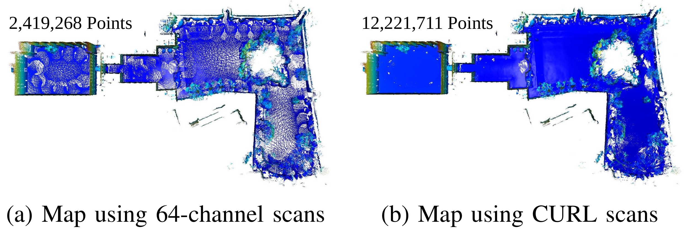

## Code coming soon

### CURL: Continuous, Ultra-compact Representation for LiDAR

This is a code repository of CURL which can continuously improve the density of the LiDAR point cloud and reduce the
storage size at the same time.

 
Left to Right: original point cloud (red), point clouds reconstructed using a same CURL with 2 times (blue) and 7 times 
(green) density increases. The CURL of this point cloud is only 16% of the original point cloud size.

 

Using the CURL method by increasing the density of the point cloud and merging them together can produce denser points
while less storage space for the map. (Left: 51.93MB, Right: 9.61MB)
