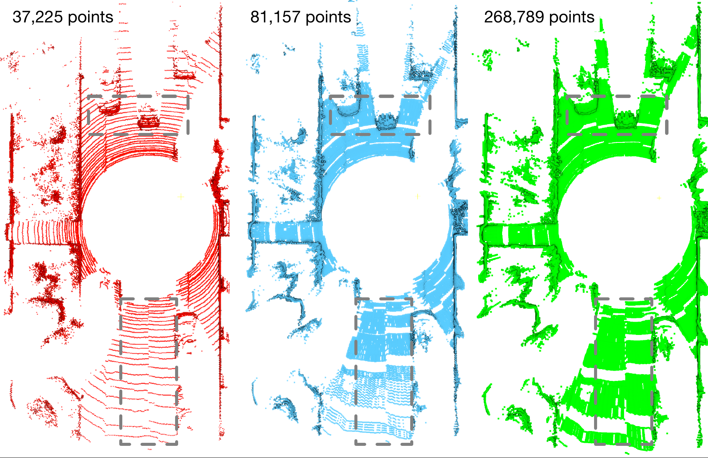

### CURL: Continuous, Ultra-compact Representation for LiDAR
This is a code repository of CURL which can continuously improve the density of the LiDAR point cloud and reduce the storage size at the same time.

