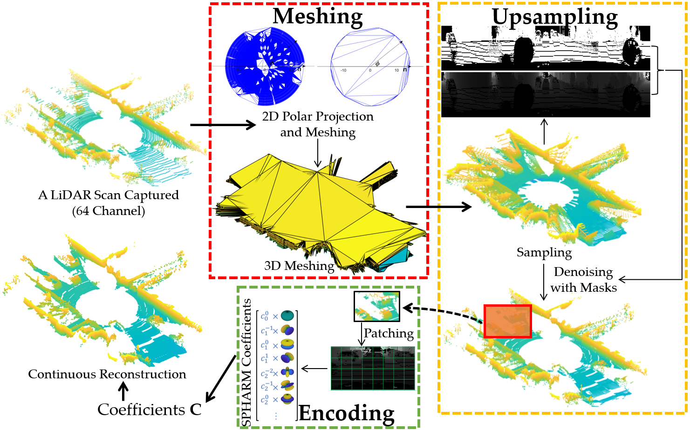

# CURL: Continuous, Ultra-compact Representation for LiDAR

**This is a repository of CURL which can continuously improve the density of the LiDAR point cloud and reduce the storage size at the same time.**

## System Architecture
<p align="center">

</p> 

We designed a framework that can compress and increase the LiDAR point cloud at the same time. It mainly contains three parts, meshing, upsampling, and encoding.

<p align="center">
 
</p> 

When doing a reconstruction, the same encoded coefficients can be used for continuous reconstruction for different densities.

## Complie and Run Example
### Dependencies
**C++17**

**Matlab**
- Computer Vision Toolbox
- Statistics and Machine Learning Toolbox

**[libigl](https://libigl.github.io/)**, and **[Eigen](https://eigen.tuxfamily.org/index.php?title=Main_Page)>=3.4.0** (These libraries will be automatically downloaded and compiled in later procedures)
### Install tools
```
sudo apt update
sudo apt install wget git libomp-dev
```
```
git clone https://github.com/perception-and-robotics-group/CURL.git
```
### Compile mex files (Ubuntu)
```
cd CURL
chmod +x mex_compilation.sh
sudo ./mex_compilation.sh
```
If compilation failed with the error ``‘Eigen::all’ is predetermined ‘shared’ for ‘shared’``, then delete ``Eigen::all`` from [CURL_Extraction_mex.h](include/cpp/include/CURL_Extraction_mex.h) line 361 and 648, and [CURL_Reconstruction_mex.h](include/cpp/include/CURL_Reconstruction_mex.h) line 71. This error is related to the version of gcc.

### Run an example
```
cd matlab
matlab .
```
Execute [KITTI_example.mlx](matlab/KITTI_example.mlx) to start a quick tutorial.
## Datasets
### [KITTI](http://www.cvlibs.net/datasets/kitti/)
The official KITTI dataset is in binary, but we provide the pcd format to download which can use directly.

### [The Newer College](https://ori-drs.github.io/newer-college-dataset/)
This dataset provides 64-channel LiDAR point clouds using an Ouster OS-1 (Gen 1)
64, and a ground truth point cloud got from Leica BLK360 which can be used for continuous reconstruction evaluation. And we used ICP to correct further the transformation between Ouster-Scans and the ground truth point cloud.

### [INDOOR LIDAR-RGBD SCAN DATASET](http://redwood-data.org/indoor_lidar_rgbd/)
Because this dataset only has dense point clouds collected using FARO Focus 3D X330 HDR scanner, therefore, we sampled 64-channel points from the dense point cloud using the parameter of Ouster OS-1 (Gen 1) 64 as the input to test CURL.

### [Download](https://www.dropbox.com/sh/0e4gc7unim69f1j/AABNqAC-_VGDOUjInC-Vt3gQa?dl=0)
Please save these files under folder [example_data](example_data).

## Example Results
### 1. KITTI
<p align="center">

</p> 
Left to Right: original point cloud (red), point clouds reconstructed using the same CURL with 2 times (blue) and 7 times (green) density increases. The CURL of this point cloud is only 16% of the original point cloud size.

### 2. Newer College
#### 1:1 Reconstruction
<p align="center">

</p> 
We have specific parameters for the 1:1 reconstruction task if very high precision is required (Continuous reconstruction results would be terrible).

#### CURL Map
<p align="center">

</p> 

Using the CURL method by increasing the density of the point cloud and merging them together can produce denser points while less storage space for the map.

### 3. Indoor
<p align="center">

</p> 

## Paper
For more information, please read our [paper](https://arxiv.org/abs/2205.06059#:~:text=Increasing%20the%20density%20of%20the,(e.g.%2C%20128%20channels).).
## Citation
```
@article{zhang2022curl,
  title={CURL: Continuous, Ultra-compact Representation for LiDAR},
  author={Zhang, Kaicheng and Hong, Ziyang and Xu, Shida and Wang, Sen},
  journal={Robotics: Science and Systems (RSS)},
  year={2022}
}
```
## Acknowledgments
This work was supported in part by EU H2020 Programme under DeepField project (grant ID 857339) and SOLITUDE project.